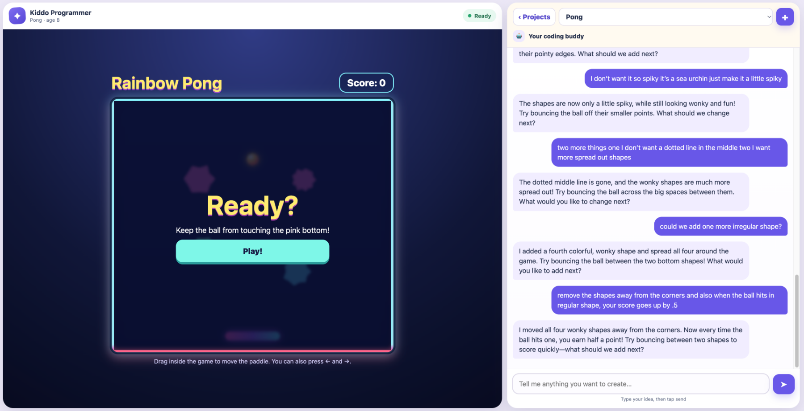
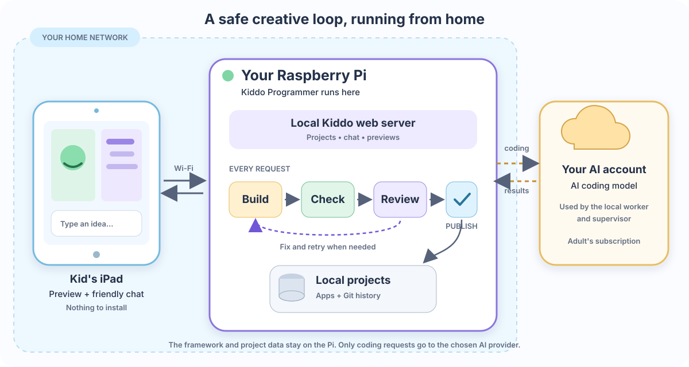

# Kiddo Programmer

Kiddo Programmer is a free, local AI programming workshop designed for kids. A child describes an idea in simple language, and a coding buddy builds a working web app beside the conversation.

Everything Kiddo Programmer owns runs on your Raspberry Pi:

- The website is served from your home network.
- Projects, full conversation files, logos, and Git history are stored on your Pi.
- There is no Kiddo Programmer cloud account, subscription, tracking, or advertising.
- The framework is free to use under the Apache-2.0 license.

AI generation uses the adult's own supported coding-agent account. Choose OpenAI Codex, Anthropic Claude Code, or Google Antigravity CLI during setup. The child's current request, age, and recent conversation context are sent to that provider to build and review the app; its terms and privacy practices apply.

## See it in action



The child plays the working app on the left and describes changes on the right.

## Simple architecture



## Designed for kids

- Age-aware conversation with short, approachable replies
- Open-ended creation instead of fixed lessons
- Touch-friendly project selection and app previews for iPad
- No microphone, purchases, external links, ads, or child accounts
- Friendly progress and errors instead of developer consoles
- A jumping Builder Bunny shows real build, check, repair, and save stages

## Builds that keep working

A worker agent builds each request in a temporary folder. Automated checks inspect the result, then a separate read-only supervisor reviews it. Problems go back to the worker for repair. Only an approved version is shown to the child; otherwise, the previous working version stays available.

Every approved update becomes a local Git commit. Generated projects live separately from the framework, so an agent cannot accidentally modify Kiddo Programmer itself.

## Safety and privacy

Generated apps are self-contained HTML and run in a sandboxed, deny-by-default preview. Browser policy blocks network connections, external resources, form submissions, frames, and access to Kiddo Programmer. Coding agents have no command-line network access, receive a scrubbed environment, work only in a temporary project folder, and never run as root.

Use Kiddo Programmer only on a trusted, WPA-protected home network with adult supervision. There is no login: every device on that network can access the workshop. Do not use it on guest or untrusted Wi-Fi, and never expose port 3000 to the internet. Teach children not to enter names, addresses, school information, or other personal details in prompts.

Conversation history is capped locally, excluded from Git, and can be removed by deleting the project's `chat.json` file. This self-hosted framework does not determine whether a particular home, school, or organization is legally covered by children's privacy law; deployers are responsible for parental notice, consent, retention, and provider choices. See [SECURITY.md](SECURITY.md) for private vulnerability reporting.

## Raspberry Pi setup

You need 64-bit Raspberry Pi OS, an iPad on the same Wi-Fi, and an adult-owned account for one supported coding agent.

### 1. Install the basic tools

```bash
sudo apt update
sudo apt install -y git nodejs npm
node --version
```

Node.js 20 or newer is required. If the version is older, install a current LTS release from [nodejs.org](https://nodejs.org/en/download).

### 2. Install the current release

The npm package is prepared but not published yet. Install from GitHub for now:

Install the agent you plan to use first:

```bash
# OpenAI Codex
npm install --global @openai/codex

# Anthropic Claude Code
npm install --global @anthropic-ai/claude-code

# Google Antigravity CLI
curl -fsSL https://antigravity.google/cli/install.sh | bash
```

Then install Kiddo Programmer:

```bash
git clone https://github.com/gmagogsfm/KiddoProgrammer.git
cd KiddoProgrammer
./install.sh
```

The guided setup selects the coding agent, completes adult sign-in when needed, installs a hardened system service, enables startup at boot, and prints the iPad address. Setup requests `sudo` only for service installation; the agents remain unprivileged.

After the npm package is published, installation will be:

```bash
npm install --global kiddo-programmer
kiddo-programmer setup
```

### 3. Open it on the iPad

Open the address printed by setup, such as `http://192.168.1.42:3000`, in Safari. Then use **Share → Add to Home Screen** for an app-like icon.

If the address changes, run `hostname -I` on the Pi or reserve the Pi's address in your router.

## Administration

For an npm installation:

```bash
kiddo-programmer status
kiddo-programmer logs
kiddo-programmer check
```

Settings live in `/etc/kiddo-programmer.env`. Restart after editing them:

```bash
sudo systemctl restart kiddo-programmer
```

`KIDDO_AGENT` accepts `codex`, `claude`, or `antigravity`. Setup writes explicit worker and supervisor models. Defaults are `gpt-5.6-sol` for Codex, the current `sonnet` alias with low effort for Claude, and `gemini-3.6-flash-low` for Antigravity.

Projects default to `~/kiddo_projects`. Back up that folder only to storage the parent controls. Conversation files are excluded from Git commits but are included in a full-folder backup.

To update an npm installation:

```bash
npm update --global kiddo-programmer
kiddo-programmer setup
```

For a Git installation, run `git pull --ff-only`, `npm test`, and `./install.sh`.

## Troubleshooting

If the page does not open, confirm that the iPad and Pi use the same Wi-Fi, then run:

```bash
sudo systemctl status kiddo-programmer
hostname -I
```

If the agent needs sign-in or the service stopped after an update, rerun `./install.sh` from a Git checkout or `kiddo-programmer setup` from an npm installation.

## Development

```bash
npm test
npm start
```

## License

Kiddo Programmer is free software under the [Apache License 2.0](LICENSE). It is provided on an "AS IS" basis without warranties or conditions of any kind. See [NOTICE](NOTICE) for attribution.
